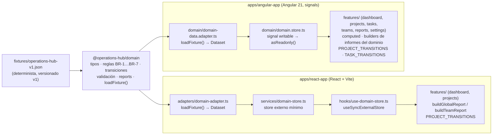

# Arquitectura frontend (Fase 2)

Este documento describe la arquitectura resultante de la Fase 2: dos aplicaciones frontend independientes (React y Angular) que consumen el mismo paquete de dominio `@operations-hub/domain`.

## 1. Qué pertenece a `@operations-hub/domain`

El paquete compartido es la única fuente de verdad del dominio de Operations Hub:

- **Tipos y unions**: `User`, `Team`, `Project`, `Task`, `Report`, `Dataset`, y los unions `ProjectStatus`, `TaskStatus`, `TaskPriority`.
- **Reglas de negocio**: BR-1 … BR-7 (integridad referencial, propietario en el equipo del proyecto, usuario en exactamente un equipo, assignee opcional, validación de dataset).
- **Máquinas de estado**: `PROJECT_TRANSITIONS`, `TASK_TRANSITIONS`, `canTransitionProject`, `canTransitionTask`.
- **Validación de inputs**: `validateUserInput`, `validateTeamInput`, `validateProjectInput`, `validateTaskInput`.
- **Cálculo de informes**: `buildGlobalReport`, `buildProjectReport`, `buildTeamReport`, `computeCompletionRate`, `computeTaskCounts`.
- **Carga del fixture**: `loadFixture()` — carga, valida y tipa `operations-hub-v1.json`.

El paquete no conoce ninguna UI: no contiene React, Angular, componentes, routing, estado de UI, servicios HTTP, backend ni persistencia. No tiene dependencias runtime.

## 2. Qué pertenece a React (`apps/react-app`)

React+Vite+TypeScript, con una frontera de datos explícita y un store mínimo sin librería. Desde la **Fase 4** implementa el contrato funcional completo (las 6 áreas funcionales del contrato):

- `src/adapters/domain-adapter.ts` — frontera «cómo se obtienen los datos»: hoy llama a `loadFixture()`; mañana puede sustituirse por un cliente API sin tocar la UI.
- `src/services/domain-store.ts` — store externo mínimo (patrón `useSyncExternalStore`) que mantiene el `Dataset` y expone **todas las mutaciones de sesión** (crear/editar proyectos y tareas, transiciones, asignaciones, cambio de equipo de un usuario) **delegando las reglas en el dominio** (`canTransitionProject`, `canTransitionTask`, `validateProjectInput`, `validateTaskInput`, `validateUserInput`). Nunca reimplementa reglas.
- `src/services/ids.ts` y `src/services/filters.ts` — helpers de sesión: siguiente id del patrón `entity-NNN` y filtros/búsqueda de presentación (subcadena case-insensitive combinada con filtros, AND).
- `src/hooks/use-domain-store.ts` — puente entre el store y React (`useSyncExternalStore`).
- `src/features/dashboard|projects|tasks|teams|reports|settings/` — páginas por área funcional; los informes se calculan con los builders del dominio (`buildGlobalReport`, `buildProjectReport`, `buildTeamReport`, `computeTaskCounts`), nunca en la UI.
- `src/features/*/project-form.tsx`, `task-form.tsx` — formularios de creación/edición que reutilizan los validadores del dominio y muestran errores inline asociados a cada campo (ACC-3/4).
- `src/components/` — componentes de presentación reutilizables (`kpi-card`, `transition-buttons`, `field`, `empty-state`, `status-badge`, `priority-badge`, `feedback`).
- `src/app/App.tsx` — composición raíz, **navegación persistente por estado entre las 6 áreas** (NAV-1…3; decisión de Fase 4: sin routing por URL) y el estado de UI de Settings (`showCompletedTasks`, en memoria, reseteado al recargar — SET-4).
- `src/app/error-boundary.tsx` — defensa mínima (los datos son un fixture síncrono, TR-1; no hay capa artificial de loading/error).

## 3. Qué pertenece a Angular (`apps/angular-app`)

Angular 21 standalone + zoneless + signals, con su propia arquitectura (no copiada de React). Desde la **Fase 5** implementa el contrato funcional completo (las 6 áreas funcionales del contrato), manteniendo las decisiones de ADR-002 (standalone, signals, DI, zoneless, sin NgRx ni librerías externas de estado):

- `src/app/domain/domain-data.adapter.ts` — servicio (DI) que actúa de frontera de datos: hoy `loadFixture()`, mañana un cliente API.
- `src/app/domain/domain.store.ts` — servicio `providedIn: 'root'` que mantiene el `Dataset` en un signal escribible **privado** y expone `dataset` como signal de solo lectura (`asReadonly`) + `computed` derivados (`isLoaded`). Expone **todas las mutaciones de sesión** (crear/editar proyectos y tareas, transiciones, asignaciones, cambio de equipo de un usuario) **delegando las reglas en el dominio** (`canTransitionProject`, `canTransitionTask`, `validateProjectInput`, `validateTaskInput`, `validateUserInput`). Nunca reimplementa reglas; mantiene inmutabilidad (nunca muta el fixture ni los objetos previos) y conserva la coherencia entre entidades relacionadas.
- `src/app/services/ids.ts` y `src/app/services/filters.ts` — helpers de sesión: siguiente id del patrón `entity-NNN` y filtros/búsqueda de presentación (subcadena case-insensitive combinada con filtros, AND). Mismo rol que en React, implementados para Angular.
- `src/app/features/dashboard|projects|tasks|teams|reports|settings/` — componentes standalone por área funcional; estado derivado con `computed` (informes con los builders del dominio: `buildGlobalReport`, `buildProjectReport`, `buildTeamReport`, `computeTaskCounts`, nunca en la UI).
- `src/app/features/projects/project-form.component.ts` y `src/app/features/tasks/task-form.component.ts` — formularios de creación/edición que reutilizan los validadores del dominio y muestran errores inline asociados a cada campo (ACC-3/4, vía `aria-invalid` + `aria-describedby`).
- `src/app/components/` — componentes de presentación reutilizables (`kpi-card`, `transition-buttons`, `field`, `empty-state`, `status-badge`, `priority-badge`, `feedback`); solo se crean cuando existe reutilización real, sin capa `shared` genérica.
- `src/app/app.ts` — composición raíz; **navegación persistente por estado entre las 6 áreas** (NAV-1…3; sin routing por URL, coherente con la decisión de Fase 4) y el estado de UI de Settings (`showCompletedTasks`, signal en memoria, reseteado al recargar — SET-4).

**Fronteras arquitectónicas (H5)**: 0 imports entre features, 1 adapter de dominio, estado de dominio encapsulado en el store, dominio compartido vía `@operations-hub/domain`, y ausencia de capa `shared` innecesaria.

## 4. Qué se comparte

- **El contrato de dominio completo** (tipos, unions, reglas, transiciones, validación, informes) vía `@operations-hub/domain` (`workspace:*`).
- **El fixture determinista** `operations-hub-v1.json`, consumido por ambas aplicaciones a través de `loadFixture()` (el JSON viaja embebido en el bundle; sin duplicación del archivo).
- **Criterios funcionales y de accesibilidad** del contrato funcional (`docs/architecture/functional-contract.md`).

## 5. Qué NO se comparte y por qué

- **La implementación del estado**: React usa un store externo mínimo con `useSyncExternalStore`; Angular usa signals con inyección de dependencias. Cada framework expresa el estado según su modelo — la comparación de ambos enfoques es parte del objetivo del laboratorio.
- **La estructura de carpetas**: React separa `adapters/services/hooks/features`; Angular organiza por features con servicios y `computed`. No hay abstracción compartida entre apps porque el dominio ya cubre lo que ambas necesitan.
- **La UI y el CSS**: cada app tiene su propio markup y estilos deliberadamente simples; la equivalencia funcional no exige identidad visual.
- **Cualquier detalle de framework** (componentes, directivas, hooks, DI) no sale del paquete de dominio.

## 6. Cómo fluye el dato

1. La aplicación carga el `Dataset` a través de su **adapter** (hoy: `loadFixture()`).
2. El `Dataset` tipado se mantiene en el **estado de dominio** de la app (store/signal).
3. Los componentes leen el estado y calculan **estado derivado** con los informes del dominio; nunca recalculan métricas localmente.
4. Las interacciones que mutan estado pasan por las **reglas del dominio** (`canTransitionProject`, `canTransitionTask`, validadores de input), no por lógica duplicada en la UI.

## 7. Cómo se ejecutan las reglas de negocio

Todas las reglas viven en `@operations-hub/domain` y se ejecutan en el paquete:

- **Al cargar el fixture**: `loadFixture()` ejecuta `validateDataset`, que comprueba estructura, enums, referencias, BR-1 … BR-5 y distribuciones; si el fixture es inválido, falla explícitamente.
- **En las mutaciones**: el store de cada app llama a `canTransitionProject`/`canTransitionTask` antes de aplicar un cambio de estado; si la transición no es válida, la mutación devuelve `false` y el estado no cambia.
- **En la UI**: los botones de transición se construyen a partir de `PROJECT_TRANSITIONS`/`TASK_TRANSITIONS`, de modo que solo se ofrecen transiciones válidas (criterios TSK-STATUS del contrato funcional).

## 8. Cómo se calculan los informes

Los informes son **datos derivados**: funciones puras del dominio que no mutan ni persisten nada.

- `buildGlobalReport(dataset)` — métricas sobre todas las tareas.
- `buildProjectReport(dataset, projectId)` — métricas de las tareas de un proyecto; `null` si el proyecto no existe.
- `buildTeamReport(dataset, teamId)` — métricas de las tareas de los proyectos del equipo + `projectsCount` y `membersCount`.
- `computeCompletionRate(completed, total, cancelled)` — `completed / (total − cancelled) × 100`, redondeado a 1 decimal; `null` cuando no hay tareas accionables.

Las apps solo invocan estos builders (con `useMemo` en React, `computed` en Angular) y formatean el resultado para mostrarlo. Los valores esperados se verifican en los tests del dominio a partir de `docs/architecture/dataset.md` §6, no se codifican en la UI.

## 9. Cómo se gestiona el estado

Se distinguen tres tipos de estado:

- **Estado de dominio**: el `Dataset` (y sus mutaciones). Vive en el store de cada app, se inicializa desde el adapter y solo cambia mediante mutaciones validadas por el dominio.
- **Estado derivado**: informes y filas calculadas. Nunca se almacena; se computa desde el estado de dominio (React: `useMemo`; Angular: `computed`).
- **Estado de UI**: selección de sección, proyecto/equipo/tarea seleccionado, búsquedas y filtros visuales, y la preferencia `showCompletedTasks` (Settings, SET-1…4). Vive localmente (React: `useState`; Angular: `signal` local / signal en `App`) y no contamina el estado de dominio.

**Decisión por framework** (documentada en ADR-002):

- **React**: store externo mínimo propio (patrón `useSyncExternalStore`, sin librería). Elegido por ser el mecanismo nativo de React 18+ para estado externo y por evitar la dependencia de una librería de estado.
- **Angular**: signals + inyección de dependencias (`signal` writable privado + `asReadonly()` + `computed`). Elegido por ser el modelo de estado moderno de Angular 21 (zoneless) sin librerías externas.

Ninguna app duplica la lógica de transición ni los cálculos de informes: ambas delegan en `@operations-hub/domain`.

## 10. Cómo sustituir el fixture por una API

La frontera es el **adapter** de cada aplicación:

- React: `src/adapters/domain-adapter.ts` → hoy `loadFixture()`.
- Angular: `src/app/domain/domain-data.adapter.ts` → hoy `loadFixture()`.

Para conectar una API real (fase posterior) basta con sustituir la implementación interna del adapter por un cliente HTTP que devuelva un `Dataset` válido, sin modificar:

- el store (recibe el mismo `Dataset` tipado),
- los componentes (leen el mismo estado y usan los mismos builders de informes),
- las reglas de negocio ni los cálculos (siguen viviendo en el dominio).

La carga actual es síncrona y determinista; una API introducirá asincronía en el adapter (el store de React ya soporta suscripción externa y Angular tiene `isLoaded` vía `computed` para estados de carga). No se implementa ninguna API en esta fase: solo se define la frontera.
